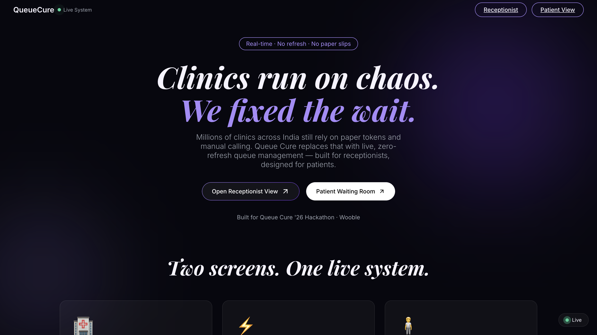
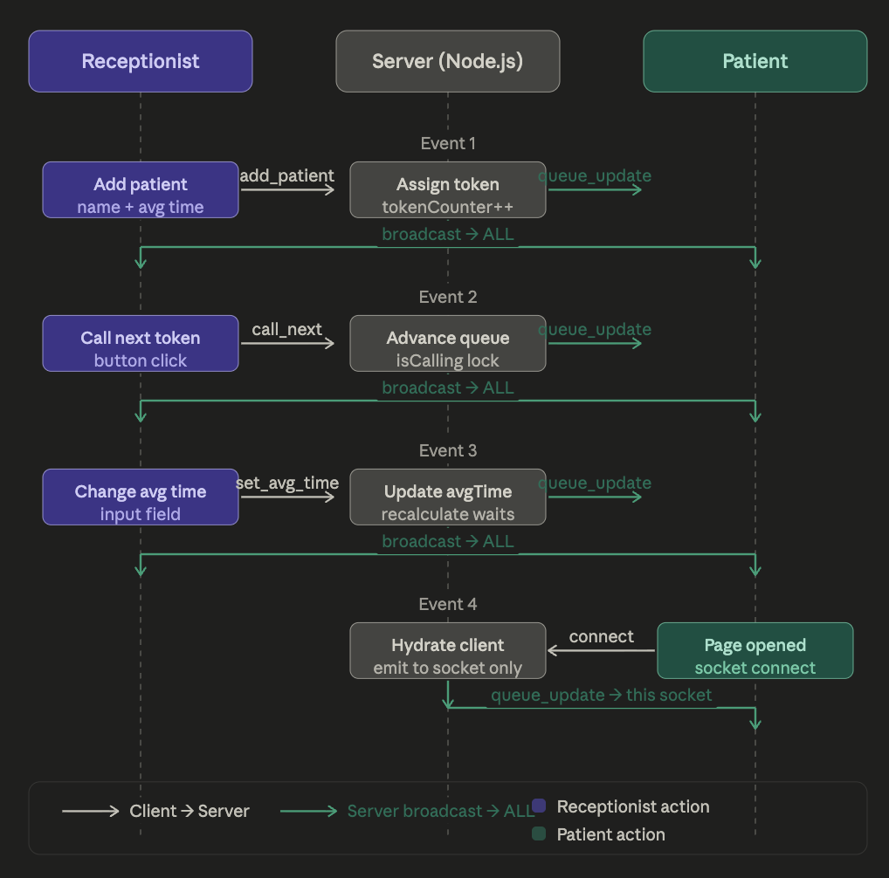

<h1 align="center">🏥 Queue Cure '26</h1>

<p align="center">
  <b>Real-time clinic queue management system</b>
</p>

<p align="center">
  <a href="https://queue-2026-haxa.vercel.app/">
    
  </a>
  <a href="https://github.com/vanshyadav/queue-2026">
    
  </a>
  <a href="https://wooble.org/hackathon/queue-cure-26">
    
  </a>
</p>

<p align="center">
  Replace paper token slips with live, synchronized queue management — built for Queue Cure '26 Hackathon.
</p>

<p align="center">
  <a href="https://queue-2026-haxa.vercel.app/">
    
  </a>
</p>

<p align="center">
  <a href="https://queue-2026-haxa.vercel.app/">https://queue-2026-haxa.vercel.app/</a>
</p>

---

## 📖 Table of Contents
- [📖 Table of Contents](#-table-of-contents)
- [❌ The Problem](#-the-problem)
- [✅ The Solution](#-the-solution)
- [🛠️ Tech Stack](#️-tech-stack)
- [🏗️ Architecture](#️-architecture)
  - [📡 Socket Events](#-socket-events)
  - [⏱️ Wait Time Formula](#️-wait-time-formula)
- [✨ Features](#-features)
  - [Receptionist Dashboard](#receptionist-dashboard)
  - [Patient Waiting Room](#patient-waiting-room)
- [🔒 Concurrency \& Edge Cases](#-concurrency--edge-cases)
- [💻 Local Setup](#-local-setup)
  - [Prerequisites](#prerequisites)
  - [Backend](#backend)
  - [Frontend](#frontend)
  - [Environment Variables](#environment-variables)
- [🚀 Deployment](#-deployment)
- [📁 Project Structure](#-project-structure)
- [⚠️ Known Limitations](#️-known-limitations)
- [👨‍💻 Author](#-author)

---

## ❌ The Problem
Millions of clinics across India still rely on paper token slips and manual calling:
- Patients wait 2–3 hours with zero visibility
- No estimated wait time
- No way to track queue position
- Receptionists manage everything from memory

---

## ✅ The Solution
Queue Cure '26 provides a **two-screen live queue management system**:

1. **📋 Receptionist Dashboard** — add patients, call next token, manage queue
2. **👨‍⚕️ Patient Waiting Room** — enter token, see live updates & estimated wait

Both sync in real-time via **WebSockets** — no refresh needed!

---

## 🛠️ Tech Stack
| Layer           | Technology                                                                                                                                                                                                         |
| --------------- | ------------------------------------------------------------------------------------------------------------------------------------------------------------------------------------------------------------------ |
| Frontend        |  +  + React Router v6 |
| Backend         |  + Express                                                                                                 |
| Real-time       | Socket.io                                                                                                                                                                                                          |
| State           | In-memory (server-side)                                                                                                                                                                                            |
| Frontend Deploy |                                                                                                                 |
| Backend Deploy  |                                                                                                                 |

---

## 🏗️ Architecture
```

```

### 📡 Socket Events
| Event          | Direction       | Description                                               |
| -------------- | --------------- | --------------------------------------------------------- |
| `add_patient`  | Client → Server | Receptionist adds a patient. Payload: `{ name, avgTime }` |
| `call_next`    | Client → Server | Advance queue to next waiting patient                     |
| `set_avg_time` | Client → Server | Update average consultation time                          |
| `skip_patient` | Client → Server | Mark a patient as no-show and advance                     |
| `queue_update` | Server → ALL    | Broadcast full state to every connected client            |



### ⏱️ Wait Time Formula
```
Estimated Wait = Tokens Ahead × Avg. Consultation Time
```

---

## ✨ Features

### Receptionist Dashboard
- ✅ Auto-assign token numbers
- ✅ Set consultation time (quick chips: 5 / 10 / 15 min)
- ✅ Call next token with concurrency lock
- ✅ Skip / no-show patients
- ✅ Undo last action (10 sec window)
- ✅ Collapsed completed tokens view
- ✅ Daily queue reset

### Patient Waiting Room
- ✅ Token number entry from paper slip
- ✅ Live current token display
- ✅ Queue position & estimated wait time
- ✅ Status states: waiting / your turn / token passed
- ✅ Name privacy (first name + last initial)
- ✅ Connection status indicator

---

## 🔒 Concurrency & Edge Cases
- **Double-click lock:** `isCalling` boolean prevents duplicate queue advances
- **Auto-reconnect:** Server emits full state on `connect`; frontend fetches `/state` on mount
- **Empty queue:** Disabled `call_next` button
- **Token passed:** Clear visual state
- **Page refresh:** State always from server (never localStorage)

---

## 💻 Local Setup

### Prerequisites
- Node.js 18+
- npm

### Backend
```bash
cd backend
npm install
npm run dev
# Runs on http://localhost:3001
```

### Frontend
```bash
cd frontend
npm install
npm run dev
# Runs on http://localhost:5173
```

### Environment Variables
Create `frontend/.env`:
```env
VITE_BACKEND_URL=http://localhost:3001
```

---

## 🚀 Deployment

| Service  | Platform | Config                                     |
| -------- | -------- | ------------------------------------------ |
| Backend  | Render   | Root: `backend` · Start: `node server.js`  |
| Frontend | Vercel   | Root: `frontend` · Env: `VITE_BACKEND_URL` |

> 💡 Render free tier spins down after 15 min of inactivity — warm it up before demoing!

---

## 📁 Project Structure
```
queue-2026/
├── frontend/
│   ├── src/
│   │   ├── pages/
│   │   │   ├── Landing.jsx
│   │   │   ├── Receptionist.jsx
│   │   │   └── Patient.jsx
│   │   ├── components/
│   │   ├── socket.js
│   │   └── App.jsx
│   ├── vercel.json
│   └── package.json
├── backend/
│   ├── server.js
│   └── package.json
└── README.md
```

---

## ⚠️ Known Limitations
- In-memory state (server restart clears queue)
- Single clinic support only
- No authentication for receptionist
- Manual token entry (no SMS/WhatsApp delivery)

---

## 👨‍💻 Author
Built with ❤️ for **Queue Cure '26 · Wooble Hackathon** by  
**[Vansh Yadav](https://vansh-yadav.vercel.app)**, IIT Roorkee